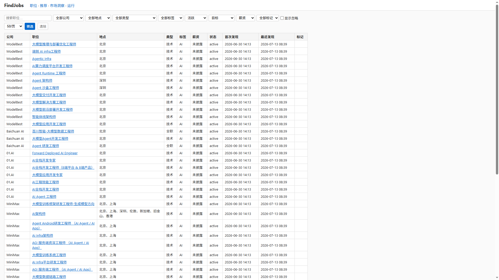
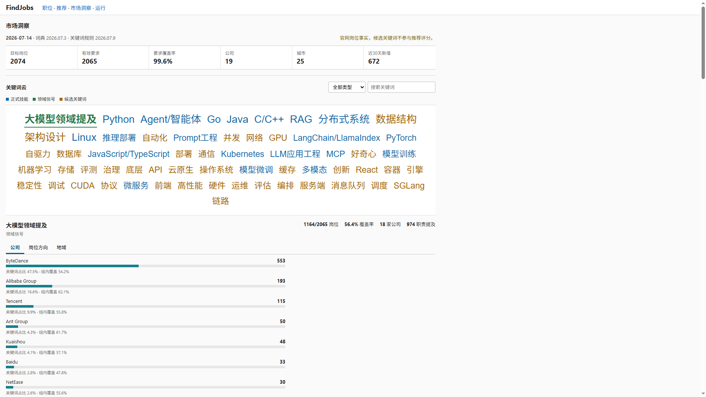

# FindJobs

本地职位采集应用 —— 仅从公司官网或官网明确链接的 ATS 系统采集职位，存入 SQLite 数据库，提供本地 Web 界面及结构化导出文件，支持 AI 辅助分析。

## 快速启动

```bash
# 安装依赖
uv sync

# 初始化数据库
uv run findjobs init

# 采集并启动 Web 界面
uv run findjobs weekly --live
uv run findjobs serve
```

打开浏览器访问 `http://127.0.0.1:8000/jobs`。

项目默认使用 `uv run findjobs <command>` 运行。也可通过 `pip install -e .` 注册 `findjobs` 命令后直接使用 `findjobs <command>`。

## 效果展示

以下截图来自本地已采集的官网公开职位事实与聚合统计，数据会随采集时间变化；截图不包含个人简历、个人画像或联系方式。

### 岗位列表与多维筛选



职位列表页面展示已采集岗位，支持按公司、规范化地域、岗位类型、标签、状态、薪资披露和用户标记等维度筛选，快速定位目标岗位。

### 关键词云与市场需求分布



市场分析页面以关键词云和分布图表呈现市场需求，帮助了解技能热度、公司需求及岗位族系分布。

## 采集范围与立场

- **仅采集公司官网或官网明确链接的 ATS（如飞书、Moka、北森等）**，不采集第三方招聘平台（猎聘、BOSS 直聘、拉勾等）。
- **不采集华为**，配置加载器拒绝任何引用华为的来源。
- **聚焦非算法 AI 工程与网络安全工程岗位**：
  - 标题或职位类型含"算法"的岗位一律排除，包括安全算法岗位。
  - 排除与 AI/安全工程无关的普通风控策略、经营分析、商业分析、数据分析、产品、销售和项目管理等职能岗；风控平台、安全合规平台等明确研发岗位仍可保留。
  - 安全方向聚焦渗透测试、SDL、AppSec、DevSecOps、安全研发、安全架构、数据安全和隐私工程等，排除普通审批、审计与合规职能岗。
- **薪资仅保存官网披露的事实**，不做任何估算或推算。未披露薪资一律标记为 `未披露`（`salary_disclosed: false`）。

## Web 界面

启动 `uv run findjobs serve` 后访问：

| 页面 | 路径 | 功能 |
|------|------|------|
| **职位列表** | `/jobs` | 浏览、筛选、搜索全部已采集职位 |
| **职位详情** | `/jobs/{id}` | 查看完整职位描述、职责与要求 |
| **推荐** | `/recommendations` | 基于个人资料的评分排序推荐 |
| **市场分析** | `/market` | 关键词云与需求分布统计 |
| **采集记录** | `/runs` | 查看各来源采集运行历史 |

### 筛选器

职位列表页面支持以下筛选维度：

- **公司** — 按公司名称筛选
- **规范化地域** — 基于数据库中的原始地点字段经规范化拆分后的地域值
- **岗位类型** — 基于规范化后的职位类别
- **标签** — `AI` / `Security` / `AI Security`
- **状态** — active（活跃）/ missing（消失）/ archived（归档）
- **相关状态** — target（目标）/ review（待审）/ excluded（排除）
- **薪资披露** — 仅显示已披露或未披露薪资的职位

### 职责与要求

职位详情页面分别展示从官网描述中提取的 `responsibilities`（工作职责）、`requirements`（任职要求）和保留的官方原文；来源未提供某部分时明确显示“未提供”，不推断缺失内容。

### 用户标记

每个职位可设置 **收藏**、**已忽略**、**已投递** 三种标记。标记语义如下：

- 标记"已忽略"时自动删除"已投递"标记，保留"收藏"
- 标记"已投递"时自动删除"已忽略"标记，保留"收藏"
- "收藏"与"已投递"可共存

### 关键词云与分布

市场分析页面（`/market`）展示：

- 技能需求关键词云
- 按公司、岗位族系、地域的职位分布
- 技能需求覆盖率分析
- 个人化学习建议（需存在 profile 文件）

需先运行 `uv run findjobs market-analyze` 生成分析数据。

## 来源配置

当前配置 **29 个来源**，其中 **28 个启用**（`is_active: true`）。

“已启用”表示来源会参与实时采集，不等于它已经在当前本地数据库完成过采集。可通过 `uv run findjobs sources` 查看每个来源最近一次运行状态和岗位数量。

**阿里巴巴中央人才目录**（`alibaba-talent`）已停用，原因：中央官方目录页面，职位已通过已验证的阿里子站来源采集。以下 5 个阿里 verified 子站均处于启用状态：

- 阿里云招聘（careers.aliyun.com）
- 通义招聘（careers-tongyi.alibaba.com）
- 夸克招聘（talent.quark.cn）
- 钉钉招聘（talent.dingtalk.com）
- Holding 招聘（talent-holding.alibaba.com）

编辑 `config/sources.yaml` 增删或启用来源。使用 `uv run findjobs sources` 审计来源覆盖状态。

### 当前公司列表

按类别排列：

**互联网科技**
腾讯 Tencent · 阿里巴巴 Alibaba · 百度 Baidu · 字节跳动 ByteDance · 快手 Kuaishou · 小米 Xiaomi · 美团 Meituan · 蚂蚁集团 Ant Group · 京东 JD · 网易 NetEase · 科大讯飞 iFlyTek

**AI 原生**
深度求索 DeepSeek · 智谱 AI Z.ai（Zhipu AI）· 月之暗面 Moonshot AI（Kimi）· MiniMax · 零一万物 01.AI · 百川智能 Baichuan AI · 面壁智能 ModelBest（MiniCPM）· 商汤科技 SenseTime · **阶跃星辰 StepFun**（当前仅校园招聘来源）

**安全厂商**
长亭科技 Chaitin · 深信服 Sangfor · 奇安信 Qianxin · **天融信 TopSec**

## 命令参考

### 数据采集与导出

```bash
# 仅采集（不运行分析）
uv run findjobs collect --live

# 采集 + 导出 + 本地分析
uv run findjobs weekly --live

# 使用离线数据重跑分析
uv run findjobs weekly --no-live

# 导出为结构化文件
uv run findjobs export --since 7 --format jsonl --output reports/weekly/jobs.jsonl
uv run findjobs export --since 14 --format csv
uv run findjobs export --tag AI --status active --salary-disclosed true
uv run findjobs export --company tencent --format jsonl
```

导出字段：`id`、`company_slug`、`company_name`、`title`、`location`、`job_type`、`status`、`salary_text`、`salary_min`、`salary_max`、`salary_currency`、`salary_period`、`salary_disclosed`、`matched_tags`、`url`、`first_seen_at`、`last_seen_at`、`published_at`。

支持 `--detail-level full` 导出包含职责与要求描述的完整数据。

### 市场分析

```bash
# 基于已导出的完整数据分析需求（无需数据库、网络或 AI）
uv run findjobs market-analyze --as-of 2026-07-14

# 指定个人资料以包含个性化建议
uv run findjobs market-analyze --profile profile/profile.md

# 排除个人分析
uv run findjobs market-analyze --no-profile-analysis
```

读取 `reports/match/jobs-full.jsonl`、`config/market_taxonomy.yaml` 和 `config/keyword_rules.yaml`，输出 `reports/market/market-analysis.json`，供 Web UI `/market` 页面消费。

### 个人资料

```bash
# 从模板初始化个人资料
uv run findjobs profile init

# 从简历（DOCX/PDF）导入，自动提取技能和经历
uv run findjobs profile import my-resume.docx
```

个人资料文件（`profile/profile.md` 和 `profile/profile.json`）及源简历文件（`.docx`、`.pdf`）已被 `.gitignore` 排除。

### 推荐

```bash
# 基于个人资料对活跃职位评分排序
uv run findjobs recommend --limit 50

# 导出为 JSON
uv run findjobs recommend --format json --output reports/match/recommendations.json
```

评分过程不修改数据库，不调用 AI。

### 其他命令

| 命令 | 用途 |
|------|------|
| `uv run findjobs sources` | 审计来源配置与采集状态 |
| `uv run findjobs adapter-audit` | 检查适配器质量门禁 |
| `uv run findjobs prune` | 重新分类存储的职位（dry-run 默认） |
| `uv run findjobs details-backfill` | 回填规范化职责与要求（dry-run 默认） |
| `uv run findjobs relevance-audit` | 只读分类器相关性审计（不修改数据库） |
| `uv run findjobs analyze weekly` | 纯本地分析已导出数据（不触发采集） |

## AI 工作流

`workflows/` 目录提供 AI 提示词模板，供外部 AI CLI 工具消费：

| 模板 | 用途 |
|------|------|
| `workflows/weekly_summary.md` | 总结一周职位动态 |
| `workflows/match_analysis.md` | 对照个人资料匹配职位 |
| `workflows/priority_ranking.md` | 对匹配结果排序优先级 |
| `workflows/career_advice.md` | 生成发展建议与学习方向 |
| `workflows/adapter_repair.md` | 从采集日志诊断适配器故障 |

所有模板均遵守以下约束：仅消费导出数据，不抓取或编造额外职位，不估算未披露薪资，不写入数据库。

### Windows CMD 快速脚本

```cmd
:: 使用 opencode
tools\run_weekly_opencode.cmd

:: 使用 Claude Code CLI
tools\run_weekly_claude.cmd
```

### 工作流约束

- 仅消费已导出的事实数据
- 不获取或编造数据之外的职位
- 不估算未披露薪资
- 不写入数据库

## 计划任务（Windows）

通过 Windows Task Scheduler 设置每周定时采集和分析：

```cmd
rem 预览默认命令（每周一 09:00，仅预览）：
uv run findjobs schedule install

rem 安装实际任务（每周五 14:30）：
uv run findjobs schedule install --weekday FRI --time 14:30 --no-dry-run

rem 仅采集（不导出/分析）：
uv run findjobs schedule install --collect-only --no-dry-run

rem 查询任务状态：
uv run findjobs schedule status

rem 立即触发任务：
uv run findjobs schedule run --no-dry-run
```

默认行为：`schedule install` 运行于 dry-run 模式，仅打印 `schtasks` 命令而不执行。需 `--no-dry-run` 才能实际注册任务。

**日志与摘要：** 每次执行记录在 `reports/logs/` 目录：

| 文件 | 说明 |
|------|------|
| `weekly_<时间戳>_<PID>_<UUID>.log` | 完整执行日志 |
| `weekly_<时间戳>_<PID>_<UUID>.summary.json` | 结构化执行摘要 |
| `weekly-latest.json` | 最近一次成功获取锁的运行摘要 |

**退出码：** 0 成功，1 失败，2 并发阻塞。

## 开发

```bash
uv sync --group dev
uv run pytest
uv run ruff check src tests
```

并行开发多公司适配器时，参见 `docs/parallel-adapter-tasks.md`。

### 被 Git 忽略的文件

以下文件和目录已被 `.gitignore` 排除，不会提交到版本库：

- 个人资料（`profile/profile.md`、`profile/profile.json`）
- 简历文档（`*.docx`、`*.pdf`）
- SQLite 数据库（`*.db`）
- 生成的周报和分析报告（`reports/` 下各子目录）
- 虚拟环境（`.venv/`、`.venv-wsl/`）
- 采集日志（`*.log`）

## 许可

MIT
